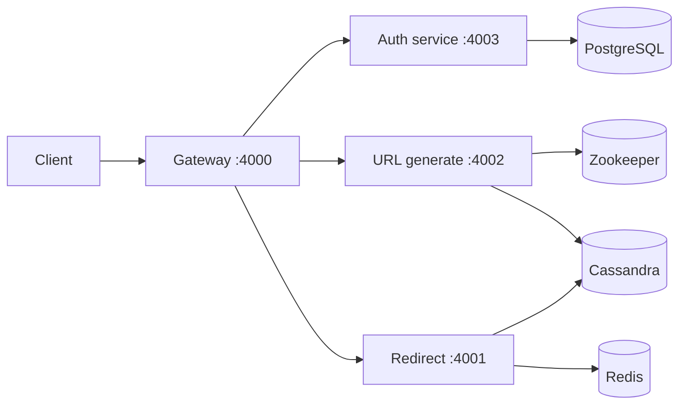

# URL Shortener

A microservices-style URL shortener: long URLs become short, shareable links. The **URL generate** service issues keys and persists mappings; the **redirect** service resolves keys quickly with a **Redis** hot path and **Cassandra** as the system of record. **Authentication** is handled by a dedicated **auth** service and enforced at the **API gateway**.

## How it works

1. An authenticated client submits a long URL through the gateway.
2. The system allocates a **unique short key** (coordinated counters + Base62 encoding).
3. The mapping **short key → original URL** (plus metadata such as `user_id` and `created_at`) is stored in **Cassandra**.
4. Clients hit the short link; the **redirect** path resolves the key (cache-first), then returns or follows the original URL.

## Functional requirements

| Requirement | Role in this repo |
|-------------|-------------------|
| **Shorten a URL** | Gateway: `POST /api/gateway/v1/urls/shorten` → URL generate service (`/api/v1/urls/shorten`). JWT is forwarded from the gateway session. |
| **Redirect to original URL** | Gateway: `GET /:shortId` → redirect service. Resolver uses **Redis** then **Cassandra**. |
| **Prevent duplicate short keys** | **Short keys** are generated from **ZooKeeper**-assigned worker IDs and monotonic counters, then encoded as **Base62**—no random retries for the same key. |
| **Prevent duplicate mappings for the same long URL** | *Design goal*: dedupe by `(user_id, normalized long URL)` or global policy can be added (e.g. Cassandra secondary index or lookup table). **Not required for key uniqueness** in the current ID strategy. |
| **User authentication** | **Auth service** (PostgreSQL, JWT, email flows via **notification** / **RabbitMQ**). Gateway uses **cookie-session** and attaches `Authorization` for downstream calls. |

## Non-functional requirements

| Concern | Approach in this design |
|--------|-------------------------|
| **High availability** | Stateless Node services behind multiple instances; state in Cassandra, Redis, Postgres, ZooKeeper. Gateway as single entry (can be load-balanced). |
| **Performance & low latency** | Redirect path: **Redis cache** (TTL-backed) before Cassandra; read-heavy workload optimized first. |
| **Reliability** | Durable writes to Cassandra; prepared statements; infrastructure from `docker-compose.yaml` for local parity. |

## Unique key generation strategies (overview)

| Strategy | Idea | Pros | Cons |
|----------|------|------|------|
| **Random string** | Fixed-length alphabet soup | Unpredictable | Collision risk; retry logic |
| **UUID** | 128-bit identifier | Extremely low collision | Long, not URL-friendly |
| **Hash + salt** | Digest of URL (+ salt) | Deterministic per URL | Length, collision handling, storage still needed |
| **Base62(counter)** | Incrementing ID → Base62 | Short, ordered, simple decode story | Needs **safe counter distribution** across instances |

### What this project uses

**ZooKeeper + per-worker ranges + Base62.** Each URL generate instance registers an ephemeral sequential node under `/url-shortener/workers/`, gets a **worker id**, and draws IDs from a **non-overlapping numeric range**. Those integers are converted to **Base62** (`0-9`, `A-Z`, `a-z`) for compact paths. This matches the “Base62 + counter management” pattern and avoids central DB contention for every new key.

## Bottlenecks and mitigations

- **High read volume (redirects)** — **Redis** in front of Cassandra for hot keys; horizontal scaling of redirect service.
- **Moderate write throughput (new links)** — Cassandra write path; ZooKeeper only for coordination, not per-request.
- **Latency-sensitive redirects** — Keep resolver thin; cache hits avoid Cassandra round-trips; consider HTTP 302 at the edge once the client contract is defined (today the redirect service returns JSON with the URL in some paths—easy to swap for a redirect response).

## High-level system design



- **API gateway** — Routing, session/JWT forwarding to auth and URL generate; authenticated routes under `/api/gateway/v1`.
- **URL generate service** — Key generation (ZooKeeper + Base62), persistence in Cassandra (`urls`: `short_id`, `original_url`, `created_at`, `user_id`).
- **Redirect service** — Resolve `short_id`: Redis → Cassandra, populate cache on miss.
- **Auth service** — Sign-up, sign-in, tokens, sessions (integrates with notification/email stack as configured).
- **Cache** — Redis for frequently accessed short IDs (redirect path).
- **Database** — Cassandra for URL mappings; PostgreSQL for users; Redis for cache/sessions as configured per service.

## Infrastructure (Docker Compose)

`docker-compose.yaml` provides local dependencies:

| Service | Port | Purpose |
|---------|------|---------|
| Redis | 6379 | Redirect cache (and other Redis usage per service config) |
| Cassandra | 9042 | URL mapping storage |
| PostgreSQL | 5432 | Auth / users |
| Elasticsearch | 9200 | Logging / observability hooks |
| ZooKeeper | 2181 | Distributed worker IDs and ID ranges |
| RabbitMQ | 5672, 15672 | Messaging (e.g. notification) |

## Repository layout

```
server/
  gateway-service/      # Port 4000 — public API, auth middleware, proxies
  auth-service/         # Port 4003
  url-generate-service/ # Port 4002 — ZooKeeper + Cassandra
  redirect-service/     # Port 4001 — Redis + Cassandra
  notification-service/ # Port 4004 — email / queue consumers
```

Each service is a **TypeScript** **Express** app using **tsyringe** for DI, **pnpm** for packages, and **Winston** / Elasticsearch-friendly logging patterns.

## Getting started (outline)

1. Start infrastructure: `docker compose up -d` (from repo root).
2. Configure each service’s `.env` (hosts, `SHORT_URL_PREFIX`, JWT secrets, DB contact points, etc.).
3. In each `server/*-service` folder: `pnpm install` → `pnpm run build` or `pnpm run dev` as needed.
4. Call the gateway on **port 4000**; ensure Cassandra schema is created (URL generate service loader runs DDL for the `urls` table on startup when configured).

---

*This README merges the product/system-design notes with the current codebase. Extend the “duplicate long URL” row when a deduplication policy is implemented end-to-end.*
